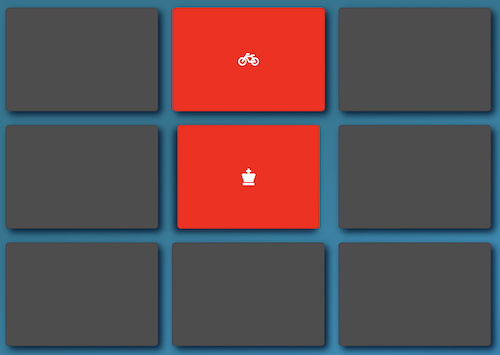
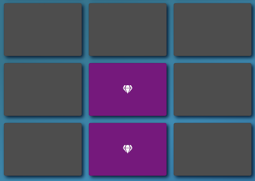

# Memory Game

**Memory Game is a card matching game. The cards are shuffled and placed face-down on the board. Once a card is flipped, it remains flipped until a second card is turned over. If both of these cards match, they remain turned over otherwise, they are flipped back. This pattern continues until the user manages to flip and match all the cards on the screen.**

**The aim is to flip through the cards one by one while remembering if you came across a matching card at an earlier point in time so that you can match the entire deck more efficiently.**

---
### Playing the Game
#### Live Demo: https://sidharthamishra.github.io/memory_game/
<br>

**You can go ahead and play the game by visiting the link provided above. The game is completely web based and therefore runs in the browser.**


<br>
_Screenshot: Memory Game_

**Playing the game is simple: you click on a card to flip it. The card that is currently open/flipped displays in blue. Once you click on another card (while one is showing), the game displays the appropriate color based on whether the two cards match: purple if they do, red if they don't. If the two cards don't match they are flipped back over.**


<br>
_Screenshot: Open Card_
<br>


<br>
_Screenshot: The Cards Don't Match_
<br>


<br>
_Screenshot: The Cards Match_
<br>

**The timer on the top of the page displays the time elapsed since you started playing the game. The moves and the star rating are also displayed and updated as you interact with the game. Each flip of a card counts as a move and the star rating is updated based on the number of moves performed. The reset button allows you to reload the game and start over.**


<br>
_Screenshot: The Header displays the Moves, Timer, Star Rating, and the Reset Button_
<br>

**Upon finishing the game, you will be greeted with a modal window containing a congratulatory message along with your game stats. From there you are provided the option to simply close the modal or start a new game.**


<br>
_Screenshot: The Modal Window_
<br>
___


### Project Structure

**This repo has the following structure/files:**

```
  memory_game
      |
      |-css / main.css
      |
      |-img / Memory_Game_Favicon.png, Screenshot[...].png
      |
      |-js / app.js
      |
      index.html
      README.md
```
___

### Technologies Used

  - HTML
  - CSS
  - JavaScript/ES6
  - Bootstrap
  - Font Awesome
  - Google Fonts
  - Google Material Icons
  ___
